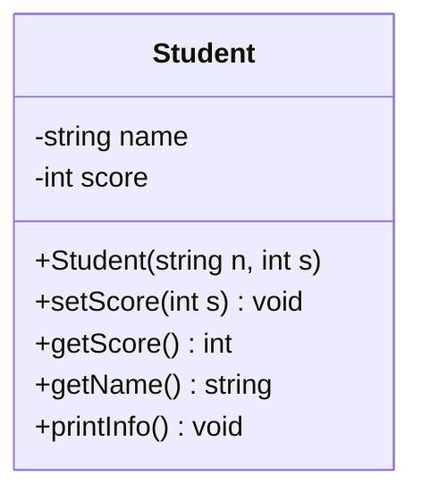

오늘 학습한 내용을 **처음 보는 사람도 이해할 수 있게** 다시 정리했다.

- 코딩테스트 Day1 문제 4개
- `unordered_set`, `unordered_map` 개념
- C++ 클래스(OOP) 입문 (`Student` 예제)
- 그림(흐름도)으로 로직 이해

---

## 0) 오늘의 큰 그림

```mermaid
flowchart LR
    A[배열 문제 입력] --> B{해시 자료구조 필요?}
    B -->|중복 확인| C[unordered_set]
    B -->|값-인덱스 매핑| D[unordered_map]
    C --> E[O(n) 평균 처리]
    D --> E
    E --> F[정답 도출]
```

---

## 1) `unordered_set` / `unordered_map` 먼저 이해하기

### 1-1. unordered_set

- **중복 없는 값 집합**
- 값이 있는지 빠르게 확인할 때 사용
- 평균적으로 `insert/find`가 `O(1)`

예)
```cpp
unordered_set<int> s;
s.insert(10);
if (s.find(10) != s.end()) {
    // 10이 존재함
}
```

**언제 쓰나?**
- 중복 체크
- 방문 여부 체크

---

### 1-2. unordered_map

- **key -> value** 매핑
- 평균적으로 `insert/find`가 `O(1)`

예)
```cpp
unordered_map<int, int> m;
m[7] = 100; // key=7, value=100

if (m.find(7) != m.end()) {
    // key 7 존재
}
```

**언제 쓰나?**
- 숫자 등장 횟수(freq)
- 값 -> 인덱스 저장

---

### 1-3. set/map랑 차이

- `set/map`: 정렬됨 (보통 `O(log n)`)
- `unordered_set/unordered_map`: 정렬 없음 (평균 `O(1)`)

코테에서 빠른 조회가 필요하면 보통 `unordered_*`를 먼저 고려한다.

---

## 2) Day1 문제 풀이

### 2-1. Two Sum

문제: 두 수 합이 target이 되는 인덱스 2개 찾기

핵심 아이디어:
- 현재 값 `x`를 볼 때 필요한 값은 `target - x`
- 이전에 본 값들을 map에 저장해두면 즉시 확인 가능

```mermaid
flowchart TD
    A[i번째 값 nums[i]] --> B[need = target - nums[i]]
    B --> C{map에 need 존재?}
    C -->|Yes| D[정답 = map[need], i]
    C -->|No| E[map[nums[i]] = i 저장]
    E --> F[다음 i]
```

```cpp
#include <vector>
#include <unordered_map>
using namespace std;

class Solution {
public:
    vector<int> twoSum(vector<int>& nums, int target) {
        unordered_map<int, int> idx; // 값 -> 인덱스

        for (int i = 0; i < (int)nums.size(); i++) {
            int need = target - nums[i];
            if (idx.find(need) != idx.end()) {
                return {idx[need], i};
            }
            idx[nums[i]] = i;
        }
        return {};
    }
};
```

- 시간복잡도: `O(n)`
- 공간복잡도: `O(n)`

---

### 2-2. Contains Duplicate

문제: 배열에 중복 원소가 있는지 확인

핵심 아이디어:
- set에 넣기 전에 이미 있으면 중복

```cpp
#include <vector>
#include <unordered_set>
using namespace std;

class Solution {
public:
    bool containsDuplicate(vector<int>& nums) {
        unordered_set<int> seen;

        for (int x : nums) {
            if (seen.find(x) != seen.end()) return true;
            seen.insert(x);
        }
        return false;
    }
};
```

- 시간복잡도: `O(n)`
- 공간복잡도: `O(n)`

---

### 2-3. Valid Anagram

문제: 두 문자열이 애너그램인지 확인

핵심 아이디어:
- 문자 개수가 같아야 함
- 알파벳 개수 배열로 카운트

```cpp
#include <string>
#include <vector>
using namespace std;

class Solution {
public:
    bool isAnagram(string s, string t) {
        if (s.size() != t.size()) return false;

        vector<int> cnt(26, 0);
        for (int i = 0; i < (int)s.size(); i++) {
            cnt[s[i] - 'a']++;
            cnt[t[i] - 'a']--;
        }

        for (int c : cnt) {
            if (c != 0) return false;
        }
        return true;
    }
};
```

- 시간복잡도: `O(n)`
- 공간복잡도: `O(1)`

---

### 2-4. Top K Frequent Elements

문제: 가장 자주 나온 숫자 k개 반환

핵심 아이디어:
1. map으로 빈도 계산
2. bucket(인덱스=빈도)에 넣기
3. 높은 빈도부터 꺼내기

```mermaid
flowchart TD
    A[nums 순회] --> B[freq map 생성]
    B --> C[bucket[f]에 숫자 저장]
    C --> D[n부터 1까지 역순 순회]
    D --> E[k개 모이면 종료]
```

```cpp
#include <vector>
#include <unordered_map>
using namespace std;

class Solution {
public:
    vector<int> topKFrequent(vector<int>& nums, int k) {
        unordered_map<int, int> freq;
        for (int x : nums) freq[x]++;

        int n = nums.size();
        vector<vector<int>> bucket(n + 1);

        for (auto& p : freq) {
            bucket[p.second].push_back(p.first);
        }

        vector<int> ans;
        for (int f = n; f >= 1 && (int)ans.size() < k; f--) {
            for (int num : bucket[f]) {
                ans.push_back(num);
                if ((int)ans.size() == k) break;
            }
        }
        return ans;
    }
};
```

- 시간복잡도: `O(n)`
- 공간복잡도: `O(n)`

---

## 3) OOP 기초 정리 - Student 클래스

클래스 학습 포인트:
- 데이터는 `private`로 보호
- 함수로만 접근 (`getter/setter`)
- 생성자로 안전한 초기값 보장



```cpp
#include <iostream>
#include <string>
using namespace std;

class Student {
private:
    string name;
    int score;

public:
    // 생성자에서 바로 검증
    Student(string n, int s) : name(n), score(0) {
        setScore(s);
    }

    // 유효 범위(0~100)만 허용
    void setScore(int s) {
        if (0 <= s && s <= 100) score = s;
    }

    int getScore() const { return score; }
    string getName() const { return name; }

    void printInfo() const {
        cout << "Name: " << name << ", Score: " << score << '\n';
    }
};

int main() {
    Student st("Jaeha", 85);
    st.printInfo();

    st.setScore(95);
    st.printInfo();

    st.setScore(120); // 무시됨
    st.printInfo();
}
```

---

## 4) 오늘 꼭 기억할 포인트

1. **조회/중복 확인**이 핵심이면 `unordered_set/map` 먼저 떠올리기
2. 클래스는 처음부터 크게 만들지 말고, `Student`처럼 작은 예제로 시작하기
3. 코테는 정답보다도 **왜 이 자료구조를 썼는지 설명할 수 있어야 함**

---

## 다음 단계

- Day2: Two Pointers / String 2문제
- OOP: `BankAccount` 예제로 메서드 설계 + 예외 케이스 처리

원하면 다음 글에서 Day2도 그림 포함으로 이어서 정리하겠다.
