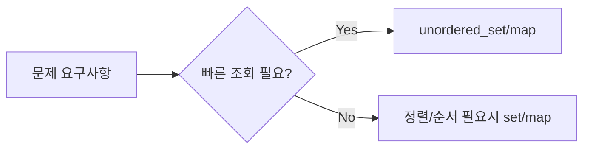

기존 통합 글에서 **코딩테스트 파트만 분리**한 버전이다.
오늘은 해시 기반 문제 4개를 C++로 정리한다.

## 왜 unordered_map / unordered_set를 먼저 쓰는가?

- 조회/삽입 평균 `O(1)`
- 중복 체크, 값-인덱스 매핑에 강함
- 코테에서 시간 단축에 매우 유리



---

## Day1 문제 1) Two Sum

```cpp
#include <vector>
#include <unordered_map>
using namespace std;

class Solution {
public:
    vector<int> twoSum(vector<int>& nums, int target) {
        unordered_map<int, int> idx;
        for (int i = 0; i < (int)nums.size(); i++) {
            int need = target - nums[i];
            if (idx.find(need) != idx.end()) return {idx[need], i};
            idx[nums[i]] = i;
        }
        return {};
    }
};
```

- 시간복잡도 `O(n)`, 공간복잡도 `O(n)`

## Day1 문제 2) Contains Duplicate

```cpp
#include <vector>
#include <unordered_set>
using namespace std;

class Solution {
public:
    bool containsDuplicate(vector<int>& nums) {
        unordered_set<int> seen;
        for (int x : nums) {
            if (seen.find(x) != seen.end()) return true;
            seen.insert(x);
        }
        return false;
    }
};
```

- 시간복잡도 `O(n)`, 공간복잡도 `O(n)`

## Day1 문제 3) Valid Anagram

```cpp
#include <string>
#include <vector>
using namespace std;

class Solution {
public:
    bool isAnagram(string s, string t) {
        if (s.size() != t.size()) return false;
        vector<int> cnt(26, 0);
        for (int i = 0; i < (int)s.size(); i++) {
            cnt[s[i] - 'a']++;
            cnt[t[i] - 'a']--;
        }
        for (int c : cnt) if (c != 0) return false;
        return true;
    }
};
```

- 시간복잡도 `O(n)`, 공간복잡도 `O(1)`

## Day1 문제 4) Top K Frequent Elements

```mermaid
flowchart TD
  A[빈도 계산 map] --> B[bucket[빈도]에 숫자 저장]
  B --> C[큰 빈도부터 역순 탐색]
  C --> D[k개 수집하면 종료]
```

```cpp
#include <vector>
#include <unordered_map>
using namespace std;

class Solution {
public:
    vector<int> topKFrequent(vector<int>& nums, int k) {
        unordered_map<int, int> freq;
        for (int x : nums) freq[x]++;

        int n = nums.size();
        vector<vector<int>> bucket(n + 1);
        for (auto& p : freq) bucket[p.second].push_back(p.first);

        vector<int> ans;
        for (int f = n; f >= 1 && (int)ans.size() < k; f--) {
            for (int num : bucket[f]) {
                ans.push_back(num);
                if ((int)ans.size() == k) break;
            }
        }
        return ans;
    }
};
```

- 시간복잡도 `O(n)`, 공간복잡도 `O(n)`

---

## 한 줄 요약

Day1 핵심은 **해시 자료구조를 문제 조건에 맞게 바로 꺼내는 습관**이다.
