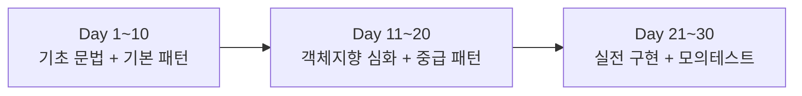
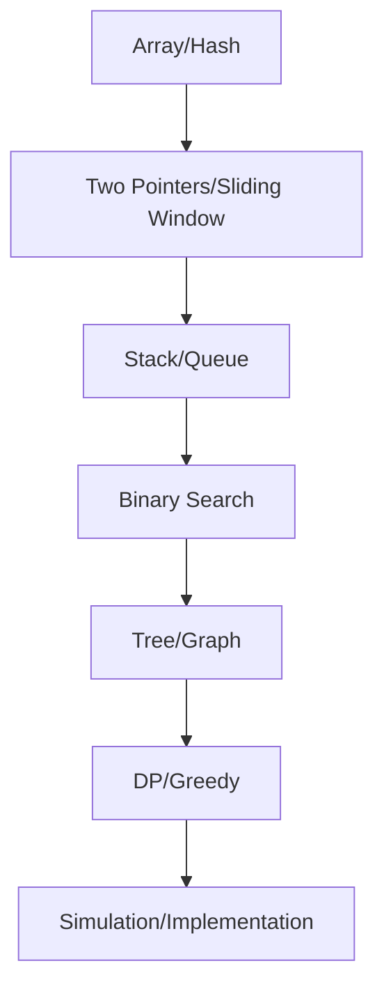

코딩테스트를 준비할 때 자주 생기는 문제가 있다.

- 알고리즘만 풀다 보면 C++ 클래스 문법이 약해지고,
- 문법만 공부하면 실전 문제 풀이 속도가 떨어진다.

그래서 이번에는 **30일 동안 하루 2문제**만 풀면서,
**클래스(OOP) 문법**과 **알고리즘 패턴**을 함께 가져가는 로드맵으로 정리했다.

---

## 학습 방식 (핵심 규칙)

1. 하루 2문제(총 60문제)
2. 문제당 40분 제한
3. 제출 후 반드시 정리
   - 사용한 자료구조/알고리즘
   - 시간복잡도/공간복잡도
   - 실수 포인트 1줄
4. 다음날 시작 전에 전날 틀린 문제 1개 복습

---

## 전체 구조 (OOP + 알고리즘 병행)



---

## 클래스(OOP) 5단계 로드맵

### 1단계 (Day 1~6): 클래스 기본기
- class / object
- 접근제어자(public/private)
- 생성자, `this`
- getter/setter
- `const` 멤버함수

### 2단계 (Day 7~12): 객체 생명주기
- 생성자 초기화 리스트
- 복사 생성자
- 대입 연산자
- 소멸자
- Rule of 3(개념)

### 3단계 (Day 13~18): 상속/다형성
- 상속 기본
- `virtual`, `override`
- 업캐스팅/다운캐스팅 개념
- 추상 클래스(순수 가상함수)

### 4단계 (Day 19~24): 실전 문법
- `static` 멤버
- `friend` (왜 필요한지)
- 연산자 오버로딩 기초
- 템플릿 함수/클래스 기초

### 5단계 (Day 25~30): 현대 C++ 감각
- 스마트 포인터(`unique_ptr`, `shared_ptr`)
- RAII 개념
- move semantics(개념 위주)
- STL 컨테이너와 클래스 결합

---

## 알고리즘 학습 흐름



---

## 30일 문제 리스트 (하루 2문제)

> 플랫폼: LeetCode 기준
> 
> 난이도 비율: Easy 40% / Medium 60%

### Day 1~10: 기초 패턴 고정

**Day 1**
- Two Sum
- Contains Duplicate
- 문법 포인트: `unordered_map`, `unordered_set`, range-for

**Day 2**
- Valid Anagram
- Group Anagrams
- 문법 포인트: 문자열 처리, `vector<string>`, 해시 키 설계

**Day 3**
- Valid Palindrome
- Two Sum II - Input Array Is Sorted
- 문법 포인트: 투포인터, 인덱스 경계

**Day 4**
- 3Sum
- Container With Most Water
- 문법 포인트: 정렬 + 중복 제거 패턴

**Day 5**
- Valid Parentheses
- Min Stack
- 문법 포인트: `stack`, 사용자 정의 클래스 멤버 관리

**Day 6**
- Daily Temperatures
- Evaluate Reverse Polish Notation
- 문법 포인트: monotonic stack, `stoi`

**Day 7**
- Binary Search
- Search Insert Position
- 문법 포인트: mid 계산(`l + (r-l)/2`)

**Day 8**
- Search a 2D Matrix
- Koko Eating Bananas
- 문법 포인트: 파라메트릭 서치

**Day 9**
- Best Time to Buy and Sell Stock
- Maximum Subarray
- 문법 포인트: 누적 상태 갱신

**Day 10**
- Longest Substring Without Repeating Characters
- Permutation in String
- 문법 포인트: 슬라이딩 윈도우 + 빈도 배열

---

### Day 11~20: 중급 패턴 + OOP 심화

**Day 11**
- Longest Repeating Character Replacement
- Minimum Window Substring
- 문법 포인트: 윈도우 조건 관리

**Day 12**
- Merge Intervals
- Insert Interval
- 문법 포인트: `sort` comparator, 구간 병합

**Day 13**
- Number of Islands
- Max Area of Island
- 문법 포인트: DFS/BFS, 방문 배열

**Day 14**
- Clone Graph
- Course Schedule
- 문법 포인트: 그래프 표현(`vector<vector<int>>`)

**Day 15**
- Maximum Depth of Binary Tree
- Invert Binary Tree
- 문법 포인트: 재귀 기초, 포인터 트리

**Day 16**
- Binary Tree Level Order Traversal
- Validate Binary Search Tree
- 문법 포인트: queue BFS, `long long` 경계

**Day 17**
- Lowest Common Ancestor of a Binary Search Tree
- Kth Smallest Element in a BST
- 문법 포인트: BST 성질 활용

**Day 18**
- Climbing Stairs
- House Robber
- 문법 포인트: 1차원 DP

**Day 19**
- Coin Change
- Decode Ways
- 문법 포인트: 점화식 설계

**Day 20**
- Jump Game
- Partition Equal Subset Sum
- 문법 포인트: Greedy vs DP 비교

---

### Day 21~30: 실전력 강화(구현/시뮬레이션 감각)

**Day 21**
- Rotting Oranges
- Pacific Atlantic Water Flow
- 문법 포인트: multi-source BFS

**Day 22**
- Product of Array Except Self
- Subarray Sum Equals K
- 문법 포인트: prefix sum + hash

**Day 23**
- Find Minimum in Rotated Sorted Array
- Search in Rotated Sorted Array
- 문법 포인트: 분기형 이분탐색

**Day 24**
- Top K Frequent Elements
- Kth Largest Element in an Array
- 문법 포인트: bucket / heap(`priority_queue`)

**Day 25**
- Longest Consecutive Sequence
- Set Matrix Zeroes
- 문법 포인트: in-place 처리

**Day 26**
- Spiral Matrix
- Rotate Image
- 문법 포인트: 구현 정확도, 인덱스 변환

**Day 27**
- Word Search
- Combination Sum
- 문법 포인트: 백트래킹 기본

**Day 28**
- Generate Parentheses
- Subsets
- 문법 포인트: 상태트리 구성

**Day 29**
- LRU Cache
- Design Add and Search Words Data Structure
- 문법 포인트: 클래스 설계 + 자료구조 결합

**Day 30**
- 모의테스트 1: Medium 랜덤 2문제(시간 90분)
- 회고: 오답 패턴 정리 + 다음 달 계획
- 문법 포인트: 실수 줄이는 코딩 습관

---

## 클래스 학습용 미니 과제 (주차별)

- 1주차: `Student` (점수 검증, getter/setter)
- 2주차: `BankAccount` (입출금, 예외 케이스)
- 3주차: `Shape` 상속 (`Circle`, `Rectangle`, `virtual area()`)
- 4주차: `SimpleVector<T>` 또는 `TodoManager` (STL 활용)

각 과제는 반드시 다음을 포함한다.
- 클래스 다이어그램(간단)
- 테스트 코드(main)
- 시간복잡도 설명(핵심 함수 기준)

---

## 예시: Student 클래스 (초급)

```cpp
#include <iostream>
#include <string>
using namespace std;

class Student {
private:
    string name;
    int score;

public:
    Student(string n, int s) : name(n), score(0) {
        setScore(s);
    }

    void setScore(int s) {
        if (0 <= s && s <= 100) score = s;
    }

    int getScore() const { return score; }
    string getName() const { return name; }

    void printInfo() const {
        cout << "Name: " << name << ", Score: " << score << '\n';
    }
};
```

---

## 학습 체크리스트

- [ ] 오늘 2문제 완료
- [ ] 복잡도 말로 설명 가능
- [ ] 클래스 미니 과제 15분이라도 진행
- [ ] 실수 노트 3줄 기록

---

## 마무리

핵심은 많이 푸는 것이 아니라,
**작게 꾸준히(하루 2문제) + 문법과 알고리즘을 같이** 가져가는 것이다.

이번 30일이 끝나면,
- LeetCode 중급 패턴이 손에 익고
- C++ 클래스/객체지향 문법도 실전에서 덜 버벅이게 된다.

다음 글에서는 Day1~Day3 실제 풀이 코드와,
틀렸던 포인트(경계값, 인덱스, 자료형)를 따로 정리해보겠다.
