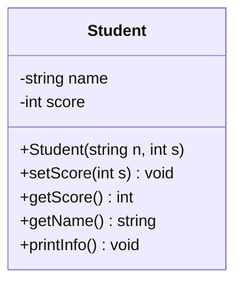
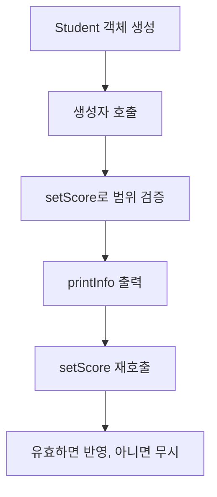

기존 통합 글에서 **OOP 파트만 분리**한 버전이다.
오늘 목표는 C++ 클래스 문법을 가장 단순한 형태로 익히는 것.

## 1) 클래스 핵심 개념

- `private`: 데이터 보호 (직접 수정 방지)
- `public`: 외부에서 사용할 함수
- 생성자: 객체 만들 때 초기 상태 보장
- getter/setter: 안전한 읽기/쓰기 통로



---

## 2) Student 예제 코드

```cpp
#include <iostream>
#include <string>
using namespace std;

class Student {
private:
    string name;
    int score;

public:
    // 생성자: 초기화 리스트 + 유효성 검증
    Student(string n, int s) : name(n), score(0) {
        setScore(s);
    }

    // setter: 0~100 점수만 허용
    void setScore(int s) {
        if (0 <= s && s <= 100) score = s;
    }

    // getter: 읽기 전용
    int getScore() const { return score; }
    string getName() const { return name; }

    void printInfo() const {
        cout << "Name: " << name << ", Score: " << score << '\n';
    }
};

int main() {
    Student st("Jaeha", 85);
    st.printInfo();

    st.setScore(95);
    st.printInfo();

    st.setScore(120); // 무효 입력 -> 무시
    st.printInfo();
}
```

---

## 3) 실행 흐름



---

## 4) 오늘 꼭 챙길 포인트

1. 멤버 변수는 `private`로 두고 함수로만 접근한다.
2. 생성자에서 객체를 항상 안전한 상태로 만든다.
3. `const` 멤버함수 습관을 들이면 버그가 줄어든다.

다음 단계는 `BankAccount` 클래스로 메서드 설계/예외 케이스를 연습하는 것.
