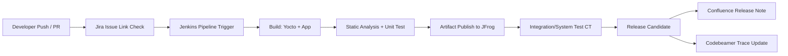
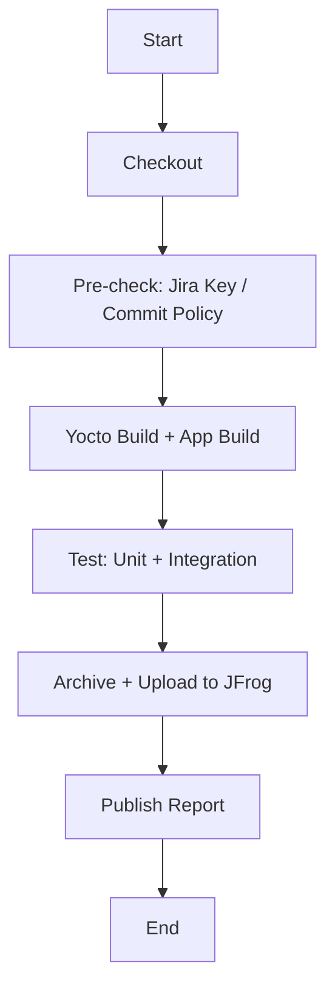

임베디드/차량 SW 환경에서 DevOps를 적용할 때 가장 많이 부딪히는 문제는,
"도구는 많은데 흐름이 끊긴다"는 점이다.

이번 글은 아래 7개 도구를 **하나의 운영 체계**로 묶어서 보는 실무 정리다.

- Jenkins
- Jira
- Yocto
- Confluence
- JFrog
- Codebeamer
- (그리고 CI/CD/CT 운영 원칙)

---

## 1) 큰 그림: CI/CD/CT를 분리해서 이해하기

- **CI (Continuous Integration)**
  - 코드 병합 시 빌드/정적검사/단위테스트를 자동 수행
  - 목적: "깨진 코드가 main에 오래 머무르지 않게"

- **CD (Continuous Delivery/Deployment)**
  - 검증된 산출물을 릴리스 가능한 형태로 자동 패키징/배포
  - 목적: "언제든 배포 가능한 상태 유지"

- **CT (Continuous Testing)**
  - 단위→통합→시스템 테스트를 파이프라인에 상시 연결
  - 목적: "결함을 뒤로 보내지 않고 앞단에서 차단"

---

## 2) 도구 연결 아키텍처

### 그림 설명

1. 개발자가 코드를 올리면 Jira 키 연계부터 체크한다.
2. Jenkins가 빌드/테스트/아티팩트 업로드의 단일 오케스트레이터가 된다.
3. 결과물은 JFrog에 버전 고정으로 저장한다(재현성 핵심).
4. CT 결과와 릴리스 변경점은 Confluence/Codebeamer까지 동기화한다.

핵심은 "빌드 성공"이 끝이 아니라,
**요구사항(트레이스) ↔ 코드 ↔ 테스트 ↔ 아티팩트**가 닫힌 고리를 만드는 것이다.

---

## 3) Jenkins 파이프라인 최소 골격

### 스테이지별 포인트

- **Checkout**: 서브모듈/manifest revision 고정
- **Pre-check**: 커밋 메시지에 Jira 키 강제, 브랜치 naming 룰 강제
- **Build**: Yocto bitbake + app 빌드 분리 캐시
- **Test**: 실패 시 즉시 중단(fail fast)
- **Upload**: JFrog 경로 규칙으로 버전 관리
- **Report**: 테스트/품질 메트릭을 Jira/Confluence 링크 가능 상태로 게시

---

## 4) 도구별 실무 역할 정의

### 4.1 Jira
- 모든 변경은 이슈 키로 시작
- PR/커밋/빌드 결과를 Jira 이슈에 역참조
- 릴리스 때 "무엇이 왜 바뀌었는지" 증적 확보

### 4.2 Jenkins
- 오케스트레이션 중심
- 파이프라인 코드는 Jenkinsfile로 버전관리
- 멀티브랜치 + shared library로 표준화

### 4.3 Yocto
- 플랫폼 빌드의 재현성 중심
- layer/recipe/pinning 전략 문서화 필수
- 빌드 시간 단축을 위해 sstate/cache 전략 함께 설계

### 4.4 JFrog
- 산출물 단일 저장소
- 빌드 번호, git SHA, manifest revision 메타데이터 동봉
- "어떤 바이너리가 어떤 소스에서 나왔는지" 추적 가능해야 함

### 4.5 Confluence
- 팀 지식 축적 허브
- 빌드 실패 패턴, 릴리스 노트, 회귀 이슈 대응 기록
- 운영 경험이 쌓일수록 MTTR 단축에 직접 기여

### 4.6 Codebeamer
- 요구사항/검증/추적성(Traceability) 축
- 자동차/기능안전 맥락에서 변경 영향분석에 강점
- 테스트 결과를 요구사항 단위로 묶어 보여주는 구조가 중요

---

## 5) 자동차/임베디드 맥락에서 꼭 넣어야 하는 체크포인트

1. **재현성**: 동일 manifest/recipe로 동일 산출물 보장
2. **추적성**: 요구사항-ID ↔ 커밋 ↔ 테스트 ↔ 아티팩트 연결
3. **분리 배포**: 플랫폼 이미지와 앱 패키지 릴리스 경로 분리
4. **품질 게이트**: 테스트 커버리지/정적분석 기준치 미달 시 머지 금지
5. **가시성**: 실패 원인(빌드/테스트/환경)을 대시보드로 즉시 식별

---

## 6) 운영 시 자주 터지는 이슈와 대응

- **이슈 A: 빌드는 되는데 배포 후 재현 안 됨**
  - 원인: 아티팩트 메타정보 누락
  - 대응: JFrog 업로드 시 git SHA + 빌드번호 + manifest revision 강제

- **이슈 B: Jira는 있는데 코드 연결이 안 됨**
  - 원인: 커밋/PR 정책 미강제
  - 대응: Jenkins pre-check 단계에서 Jira 키 없는 커밋 실패 처리

- **이슈 C: Yocto 빌드 시간 폭증**
  - 원인: 캐시 전략 미흡, 레이어 의존성 증가
  - 대응: sstate mirror 운영, 변경 레이어 단위 빌드 최적화

- **이슈 D: 테스트는 많은데 신뢰가 낮음**
  - 원인: CT 분류/우선순위 부재
  - 대응: smoke/regression/full 분리 + 병렬 실행 구조 도입

---

## 7) 바로 적용 가능한 2주 도입 계획

### Week 1
- Jenkinsfile 표준 템플릿 확정
- Jira 키 정책/브랜치 정책 강제
- JFrog 업로드 규칙(경로/메타데이터) 확정

### Week 2
- CT 분류(sanity/smoke/regression) 도입
- Confluence 릴리스 노트 자동 템플릿 적용
- Codebeamer 트레이스 링크 최소셋 연결

---

## 마무리

DevOps는 도구 나열이 아니라 **흐름 설계**다.
특히 차량/임베디드처럼 검증 책임이 큰 도메인에서는,
"빠르게"보다 "빠르면서 추적 가능한 방식"이 핵심이다.

Jenkins, Jira, Yocto, Confluence, JFrog, Codebeamer를
각자 잘 쓰는 것보다,
**한 번의 변경이 끝까지 연결되는 파이프라인**을 만드는 것이
실전에서 가장 큰 차이를 만든다.
