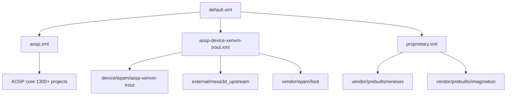

Day2는 기존 계획대로 **POC 데모 9개 Git 스터디를 계속 진행**하면서,
그중 `android-manifest`를 깊게 파고들었다.

이번 목표는 단순히 "프로젝트가 많다"가 아니라,
**실제로 빌드/통합 시 어떤 레이어를 먼저 봐야 하는지**를 빠르게 판단할 수 있는 맵을 만드는 것이었다.

---

## 1. 왜 android-manifest를 먼저 보는가

`android-manifest`는 코드 그 자체보다,
"어떤 코드 조합을 어떤 리비전으로 묶어 빌드할지"를 결정하는 **구성의 진실 소스(Source of Truth)**다.

- `default.xml`에서 포함(include) 트리를 정의하고
- `aosp.xml`에서 대규모 AOSP 프로젝트 집합을 가져오고
- `aosp-device-xenvm-trout.xml`, `proprietary.xml`로 플랫폼/벤더 특화 조합을 덧붙인다.

즉, 증상이 커널에서 보여도 원인은 manifest 조합일 수 있다.

---

## 2. include 구조 (핵심 그림)

### 그림 설명

- `default.xml`은 작지만 전체 조합의 진입점이다.
- `aosp.xml`은 기본 플랫폼 풀(대규모)이며,
  실제 POC 특화 요소는 `aosp-device-xenvm-trout.xml`, `proprietary.xml`에서 결정된다.
- 그래서 문제 추적 시,
  1) 기본 AOSP 문제인지
  2) 디바이스/벤더 overlay 문제인지를 먼저 분리하는 게 효율적이다.

---

## 3. Day2 추출 결과 - Product 관점 5개

> 기준: 앱/디바이스/벤더(사용자 체감 기능/제품화 경로에 직접 영향)

1. `device/epam/aosp-xenvm-trout`
   - name: `ts-kefico-gen5-demo/x5h-fusion-poc/android_device`
   - revision: `refs/tags/ren_v1.0.0`
   - 의미: 보드/디바이스 정의의 핵심 진입점

2. `vendor/prebuilts/renesas`
   - name: `ts-kefico-gen5-demo/x5h-fusion-poc/gen5-prebuilts`
   - revision: `refs/tags/ren_v1.0.0_android`
   - 의미: 플랫폼 종속 prebuilt 공급축

3. `vendor/prebuilts/imagination`
   - name: `ts-kefico-gen5-demo/x5h-fusion-poc/ddk-um-bin`
   - revision: `refs/tags/ren_v1.0.0`
   - 의미: GPU user-space 바이너리 축

4. `packages/apps/Car/Launcher`
   - name: `platform/packages/apps/Car/Launcher`
   - 의미: IVI UX의 진입 UI 축

5. `packages/apps/Car/Cluster`
   - name: `platform/packages/apps/Car/Cluster`
   - 의미: 차량화면/클러스터 연동 UX 축

---

## 4. Day2 추출 결과 - Kernel/Toolchain 관점 5개

> 기준: 커널 prebuilt + 컴파일러/빌드체인 안정성에 직접 영향

1. `kernel/prebuilts/6.1/x86_64`
   - name: `kernel/prebuilts/6.1/x86-64`

2. `kernel/prebuilts/6.6/x86_64`
   - name: `kernel/prebuilts/6.6/x86-64`

3. `kernel/prebuilts/mainline/x86_64`
   - name: `kernel/prebuilts/mainline/x86-64`

4. `prebuilts/clang/host/linux-x86`
   - name: `platform/prebuilts/clang/host/linux-x86`

5. `prebuilts/gcc/linux-x86/host/x86_64-linux-glibc2.17-4.8`
   - name: `platform/prebuilts/gcc/linux-x86/host/x86_64-linux-glibc2.17-4.8`

---

## 5. 의존성 읽는 방법 (실전용)

### 그림 설명

이 순서를 추천하는 이유:

- 현업에서는 증상이 앱에서 보여도 원인은 하단 레이어일 수 있다.
- 하지만 처음부터 커널로 내려가면 조사 비용이 크다.
- 따라서
  1) Product 레이어에서 증상 범위를 좁히고,
  2) manifest 태그/리비전을 확인한 뒤,
  3) kernel/toolchain 축으로 내려가는 방식이 가장 빠르다.

---

## 6. 이번 스터디에서 얻은 결론

1. **default.xml include 구조를 먼저 보는 습관**이 필수다.
   - 여기서 분석 범위가 즉시 정리된다.

2. `aosp.xml` 자체보다,
   **xenvm-trout + proprietary overlay**가 POC 특화 포인트다.

3. 커널/툴체인 축은
   `kernel/prebuilts/* + prebuilts/clang/gcc`를 최소셋으로 묶어 봐야 한다.

4. Day2 관점에서의 실무 체크리스트:
   - manifest tag/revision 변경 여부
   - device/vendor prebuilt 동기화 여부
   - clang/gcc host prebuilt 호환성

---

## 7. 다음 액션 (Day3 예고)

- `android-kernel-manifest`와 교차 비교해서
  **kernel 관련 manifest가 android-manifest와 어떻게 분리/연동되는지** 정리할 예정.
- 목표는 "문제 발생 시 어느 manifest를 먼저 수정해야 하는가"를
  1페이지 룰로 만드는 것.

---

## 부록 - Day2 작업 로그 메모

- 총 project 수(집계): 약 1381
- 집중 분석 파일:
  - `default.xml`
  - `aosp-device-xenvm-trout.xml`
  - `proprietary.xml`
  - `aosp.xml` (샘플링 기반 분류)

POC 9개 Git 스터디는 계속 진행한다.
이번 글은 그중 `android-manifest`의 구조를 실무적으로 읽는 기준을 만든 Day2 기록이다.
